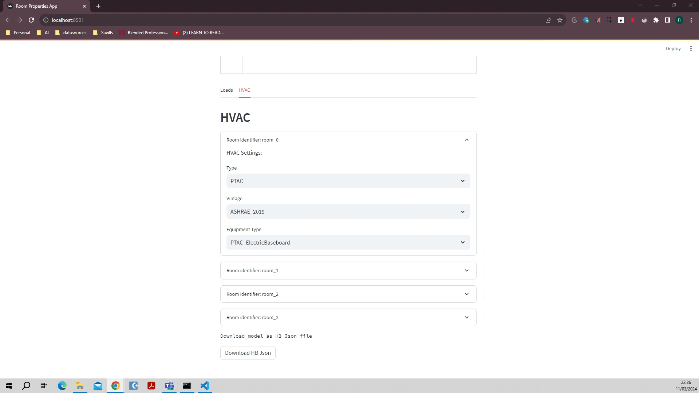

# Room Properties Visualization App 🏠

Explore the boundaries of building modeling and HVAC analysis with our Room Properties Visualization App. Powered by Streamlit and featuring advanced 3D visualization, this tool enables users to adjust room parameters and HVAC systems, offering immediate insights into the performance and environmental impact of building designs.

## Features 🌈

### Interactive Design Interface
Adjust building parameters such as footprint, floor height, and number of floors through user-friendly sliders and input fields. This immediate interaction allows for a dynamic exploration of architectural possibilities.

### Dynamic 3D Visualization
Our app employs Honeybee and Ladybug for 3D visualization, providing a real-time view of your building model as parameters are modified. This immersive experience helps in understanding spatial relationships and design impacts.

### Comprehensive HVAC Analysis
The app supports a broad spectrum of HVAC system configurations, enabling detailed analysis of their influence on building comfort and energy efficiency. Users can explore and customize various HVAC types, including:

- **All-Air Systems:** Choose from PSZ, VAV, PVAV, and more, suitable for different building sizes and types.
- **Radiant Systems:** Including radiant floors and ceilings, these options offer comfort and efficiency by directly heating or cooling building occupants.
- **DOAS (Dedicated Outdoor Air Systems):** Integrated with other HVAC components, DOAS ensures fresh air supply, improving indoor air quality.
- **Hybrid Systems:** Combining the benefits of multiple system types to achieve optimal environmental control and energy usage.

Each HVAC option is customizable, allowing for adjustments in efficiency, control types, and integration with renewable energy sources.

### Advanced Room Property Configurations
Dive deep into room-specific configurations to optimize the design for comfort and efficiency:

- **Thermal Properties:** Adjust insulation levels, window-to-wall ratios, and glazing types to improve energy performance.
- **Lighting and Equipment Gains:** Fine-tune lighting levels and equipment heat gains to reflect actual usage patterns, reducing energy consumption and enhancing occupant comfort.
- **Occupancy Patterns:** Model realistic occupancy scenarios to ensure systems are sized and operated efficiently.
- **Natural Ventilation:** Explore the potential of natural ventilation strategies to reduce mechanical cooling loads and enhance indoor air quality.
- **Environmental Impact Analysis:** Assess the carbon footprint and energy consumption of different HVAC systems and building configurations, supporting sustainable design decisions.

## Getting Started 🚀

To dive into the world of advanced building modeling:

1. **Setup:** Ensure Python 3.6+ is installed. Install required libraries with `pip install -r requirements.txt`.
2. **Launch:** Run `streamlit run app.py` to start the application.
3. **Design:** Use the interactive interface to configure your building and HVAC systems.
4. **Visualize:** Explore the 3D visualization to review and refine your designs.

## Contributing 🤝

We welcome contributions! Feel free to fork the project, make improvements, and submit pull requests. Open an issue for any bugs you find or enhancements you suggest.

## License 📜

This project is proudly licensed under the MIT License. See the LICENSE.md file for details.

